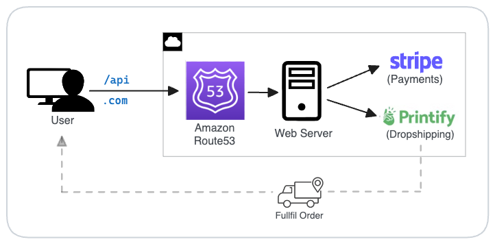

# SwagSticker.com

- E-commerce store for developer laptop stickers 🛒 💻
- Secure, passwordless login with **JSON Web Tokens (JWT)**
- Automated dropshipping via **Printify** API
- Fast, embedded **Stripe** Checkout for payments
- Built with **Next.js** and **TypeScript**

https://github.com/user-attachments/assets/c68b9266-fea0-42e5-86fb-af4fb6efff36

<!-- ## 🎯 Project Overview -->
<!-- - Developed an autonomous, full-stack **e-commerce** store using **Next.js** and **TypeScript**, supporting automated dropshipping via **Printify SDK** -->
<!-- - Implemented **passwordless authentication** using JSON Web Tokens (JWT) for a secure, seamless checkout experience -->
<!-- - Integrated **Stripe SDK** with embedded payment forms and Webhooks for secure, automated payment processing, including bot detection for fraud prevention -->
<!-- - Enhanced page load speed and SEO with **server-side rendering**, achieving sub-2.5s initial load times -->
<!-- - Scaled to handle 1,500+ monthly active users, supporting up to 50 requests per second during peak traffic -->
<!-- - Conducted load tests to validate system reliability, achieving a >95% success rate with **P90 response times** between under 300 ms -->

## 🛠️ Built With

- **Framework**: Next.js (React), TailwindCSS
- **Language**: TypeScript
- **Third-Party**: Stripe SDK (payments), Printify SDK (dropshipping)
- **Hosting**: Vercel, Amazon Route53

## ⭐️ Features

 _Authenticate with convenient and secure email-only login._

 _Browse the catalog, filter by category, and sort._

_Add item to cart, proceed to checkout._

 _Place order and checkout with secure embedded Stripe form, optimized for conversions._

 _View orders, download receipts, and track shipping status._

## 🏗️ System Diagram



## 💻 Local Development

#### Prerequisites

- **Node.js** – [Install here](https://nodejs.org/en/download).
- **Stripe** – [Developer account](https://stripe.com) with API keys.
- **Gmail Integration** – generate credentials [here](https://security.google.com/settings/security/apppasswords):
- **Printify** – [Developer account](https://printify.com) with API keys.
- **Printify Shop ID** – Retrieve with:
  ```sh
  curl -L https://api.printify.com/v1/shops.json --header "Authorization: Bearer $PRINTIFY_API_TOKEN"
  ```

#### Setup

```sh
git clone https://github.com/spencerlepine/swagsticker.com
cd swagsticker.com
cp .env.template .env.development
npm install
npm run dev
# visit http://locahost:3000
```

## License

GNU General Public License v3.0 or later

See [COPYING](COPYING) to see the full text.
