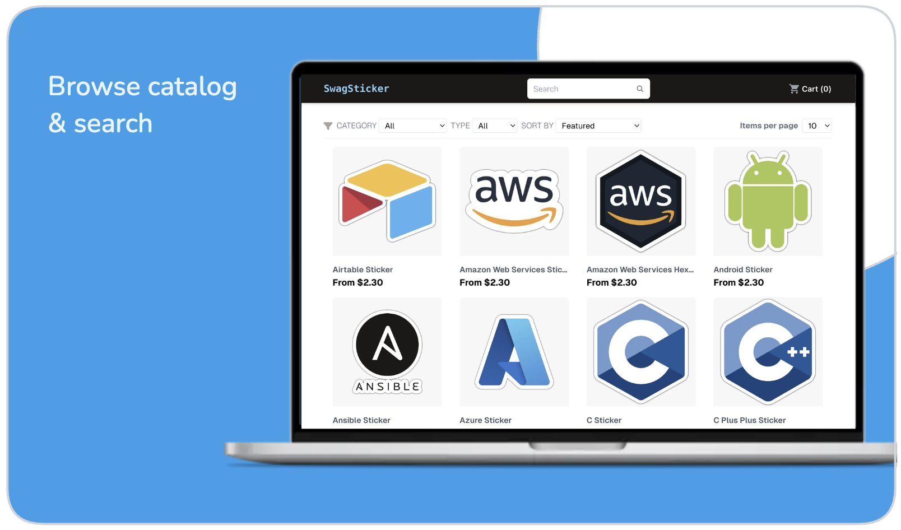
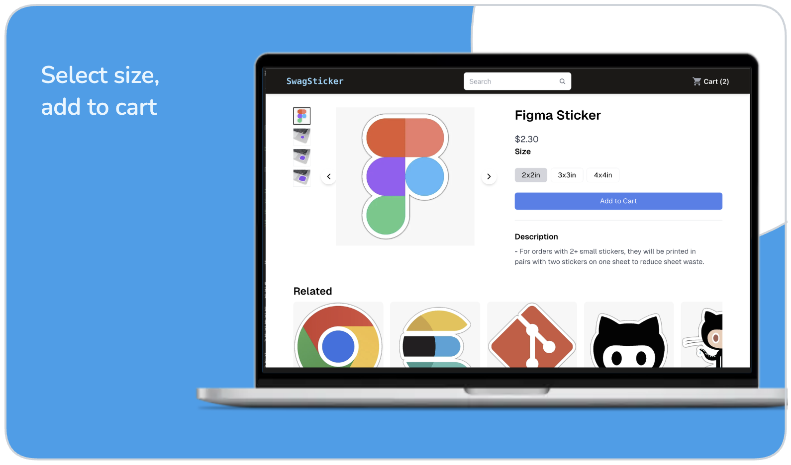
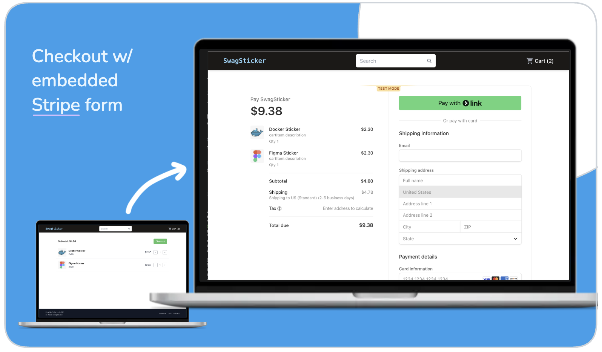

# SwagSticker.com 

Full-stack e-commerce store for developer laptop stickers. Automated with dropshipping

https://github.com/user-attachments/assets/d32962b3-6aa8-401c-ab43-440fff3e31cc


## 🎯 Project Overview

<!-- TODO_README -->

- designed autonomous and scalable e-commerce store
- enabled both guest checkout and no-password login for seamless checkout experience (JSON-Web-Token (JWT))
- designed an accessible, responsive, and performant UI with Next.js and TailwindCSS
- utilized open-source SDKs to integrate third-party APIs
- reduced initial load time to 1.2secs
- generated product images with OpenCV python script
- optimized load times and SEO with server-side rendering
- avoided complex database setup with JSON product catalog and GraphQL for easy migration to headless CMS
- secured checkout payments with stripe forms and bot detection
- load test, >95% success rate with <300ms response for up to XXX users peak traffic

## 🛠️ Built With

- **Framework**: Next.js (React), TailwindCSS
- **Language**: TypeScript
- **Third-Party**: Stripe SDK (payments), Printify SDK (dropshipping)
- **Hosting**: Vercel, Amazon Route53

## ⭐️ Features

<!--  _Users can use guest mode, or register/login._ -->

 _Browse the catalog, filter by category, and sort._

_Add item to cart, proceed to checkout._

 _Place order and checkout with secure embedded Stripe form, optimized for conversions._

<!--  _View orders, download receipts, and track shipping status._ -->

## 💻 Local Development

#### Prerequisites

- **Node.js** installed on your machine (download [here](https://nodejs.org/en/download))
- [Stripe](https://stripe.com) developer account (+ API keys)
- [stripe-cli](https://github.com/stripe/stripe-cli) (`$ brew install stripe/stripe-cli/stripe`)
- Whitelisted endpoints for [Stripe](https://dashboard.stripe.com) webhook (`https://website.com/api/v1/webhook/checkout`)
- [Printify](https://printify.com) developer account (+ API keys)

#### Installation

```sh
git clone https://github.com/spencerlepine/swagsticker.com
cd swagsticker.com
cp .env.template .env.development
npm install
```

#### Run Locally

```sh
stripe login
stripe listen --forward-to localhost:3000/api/v1/webhook/checkout
# *open separate terminal*

npm run dev
# visit http://locahost:3000
```

#### Local Docker Container

```sh
stripe login
stripe listen --forward-to localhost:3000/api/v1/webhook/checkout
# *open separate terminal*

cp .env.template .env.development
docker-compose -f ./docker/docker-compose.dev.yml --env-file .env.development up --build
# visit http://locahost:3000
```

#### Production Build

```sh
cp .env.template .env.production
npm run build
```

## License

GNU General Public License v3.0 or later

See [COPYING](COPYING) to see the full text.
