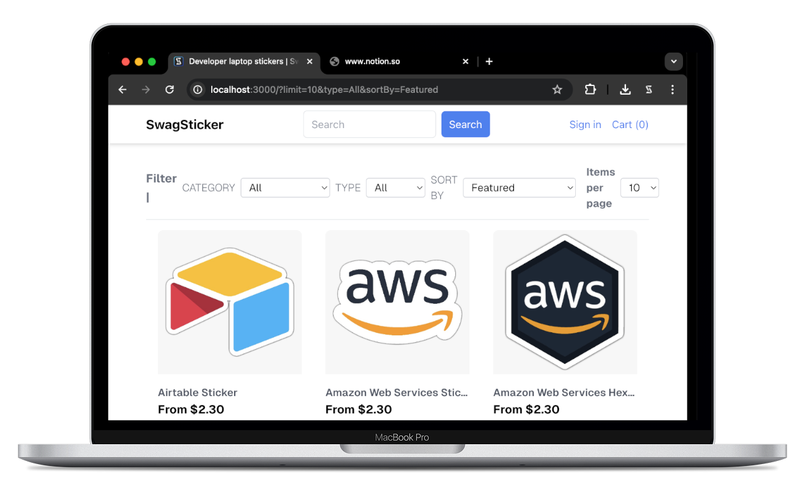
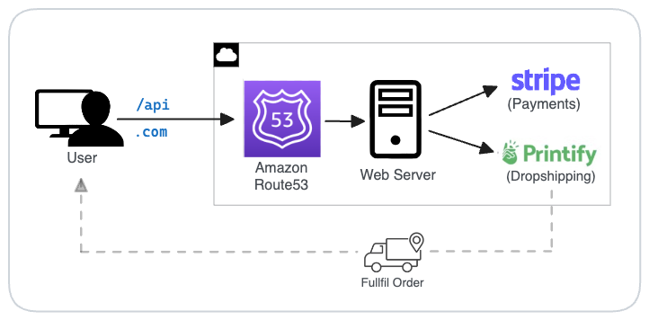

# SwagSticker.com 

E-commerce store for developer laptop stickers, fully autonomous and scale-abe. Built with Jamstack and server-side rendering.



## 🎥 Demo Video

https://github.com/jadiaheno/vention-machine-cloud-test/assets/13062328/a42d55bb-0381-4d16-9ea3-24aced02e5d3

## 🎯 Project Overview

<!-- TODO_README -->

- designed autonomous and scalable e-commerce store
- enabled both guest checkout and no-password login for seamless checkout experience (JSON-Web-Token (JWT))
- designed an accessible, responsive, and performant UI with Next.js and TailwindCSS
- utilized open-source SDKs to integrate third-party APIs
- reduced initial load time to 1.2secs
- generated product images with OpenCV python script
- optimized load times and SEO with server-side rendering
- avoided complex database setup with JSON product catalog and GraphQL for easy migration to headless CMS
- secured checkout payments with stripe forms and bot detection
- load test, >95% success rate with <300ms response for up to XXX users peak traffic

## 🛠️ Built With

- **Framework**: Next.js (React), TailwindCSS
- **Language**: TypeScript
- **Hosting**: Vercel (w/ Amazon Route53 domain)
- **Third-Party**: Stripe (payments), Printify (drop-shipping)

> **Specifications:**
>
> - Node.js: >=v20
> - React.js: v18
> - Next.js: v14 (App Router)
> - Vercel: serverless, hobby plan

## 🏗️ System Diagram

<!-- TODO_README -->



## ⭐️ Features

<!-- TODO_README -->

- <auth feature no pass, or stay guest>
- <browse the catalog, search, filter>
- <add items to cart, proceed to checkout>
- <use secure stripe form, place order>
- <track shipping status>

## 💻 Local Development

📌 Note: this demo can be run locally; the production code is private for security reasons

#### Prerequisites

- **Node.js** installed on your machine (download [here](https://nodejs.org/en/download))
- Stripe developer account (+ API keys)
- `stripe-cli` (`$ brew install stripe/stripe-cli/stripe`)
- Printify developer account (+ API keys)

#### Installation

```sh
git clone https://github.com/spencerlepine/swagsticker.com
cd swagsticker.com
cp .env.template .env.development
npm install
```

#### Run Locally

```sh
stripe login
stripe listen --forward-to localhost:3000/api/v1/webhook/checkout

# *open separate terminal*

npm run dev
# visit http://locahost:3000
```

#### Local Docker Container

```sh
stripe login
stripe listen --forward-to localhost:3000/api/v1/webhook/checkout

# *open separate terminal*

cp .env.template .env.development
docker-compose -f ./docker/development/docker-compose.yml --env-file .env.development up -d
# visit http://locahost:3000
```

#### Production Build

```sh
cp .env.template .env.production
npm run build
```

## License

GNU General Public License v3.0 or later

See [COPYING](COPYING) to see the full text.
