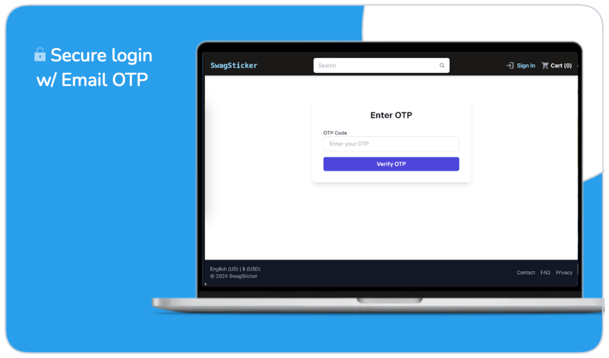
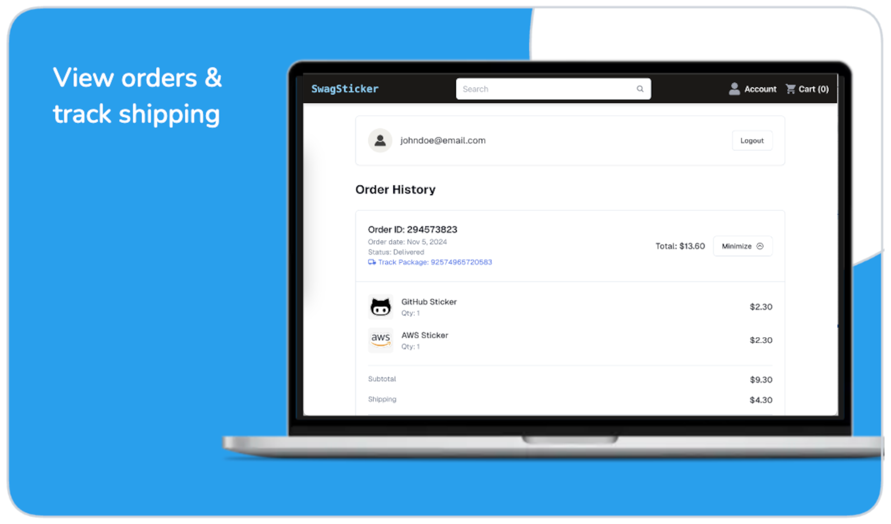

# SwagSticker.com 

Full-stack e-commerce store for developer laptop stickers. Automated with dropshipping

https://github.com/user-attachments/assets/d32962b3-6aa8-401c-ab43-440fff3e31cc

## 🎯 Project Overview

- Developed an autonomous, full-stack **e-commerce** store using **Next.js** and **TypeScript**, supporting automated dropshipping via **Printify SDK**
- Implemented **passwordless authentication** using JSON Web Tokens (JWT) for a secure, seamless checkout experience
- Integrated **Stripe SDK** with embedded payment forms and Webhooks for secure, automated payment processing, including bot detection for fraud prevention
- Enhanced page load speed and SEO with **server-side rendering**, achieving sub-2.5s initial load times
- Scaled to handle 1,500+ monthly active users, supporting up to 50 requests per second during peak traffic
- Conducted load tests to validate system reliability, achieving a >95% success rate with **P90 response times** between under 300 ms

## 🛠️ Built With

- **Framework**: Next.js (React), TailwindCSS
- **Language**: TypeScript
- **Third-Party**: Stripe SDK (payments), Printify SDK (dropshipping)
- **Hosting**: Vercel, Amazon Route53

## ⭐️ Features

 _Authenticate with convenient and secure email-only login._

 _Browse the catalog, filter by category, and sort._

_Add item to cart, proceed to checkout._

 _Place order and checkout with secure embedded Stripe form, optimized for conversions._

 _View orders, download receipts, and track shipping status._

## 🏗️ System Diagram


## 💻 Local Development

#### Prerequisites

- **Node.js** installed on your machine (download [here](https://nodejs.org/en/download))
- [Stripe](https://stripe.com) developer account (+ API keys)
- [stripe-cli](https://github.com/stripe/stripe-cli) (`$ brew install stripe/stripe-cli/stripe`)
- Whitelisted endpoints for [Stripe](https://dashboard.stripe.com) webhook (`https://website.com/api/v1/webhook/checkout`)
- [Printify](https://printify.com) developer account (+ API keys)

#### Installation

```sh
git clone https://github.com/spencerlepine/swagsticker.com
cd swagsticker.com
cp .env.template .env.development
npm install
```

#### Run Locally

```sh
stripe login
stripe listen --forward-to localhost:3000/api/v1/webhook/checkout
# *open separate terminal*

npm run dev
# visit http://locahost:3000
```

## 🐋 Docker

#### Local Docker Container

```sh
stripe login
stripe listen --forward-to localhost:3000/api/v1/webhook/checkout
# *open separate terminal*

cp .env.template .env.production
docker-compose -f ./docker/docker-compose.dev.yml --env-file .env.production up --build
# visit http://locahost:3000
```

#### Production Docker Build

```sh
cp .env.template .env.production
docker-compose -f ./docker/docker-compose.prod.yml --env-file .env.production up --build
# visit http://localhost
```

## License

GNU General Public License v3.0 or later

See [COPYING](COPYING) to see the full text.
