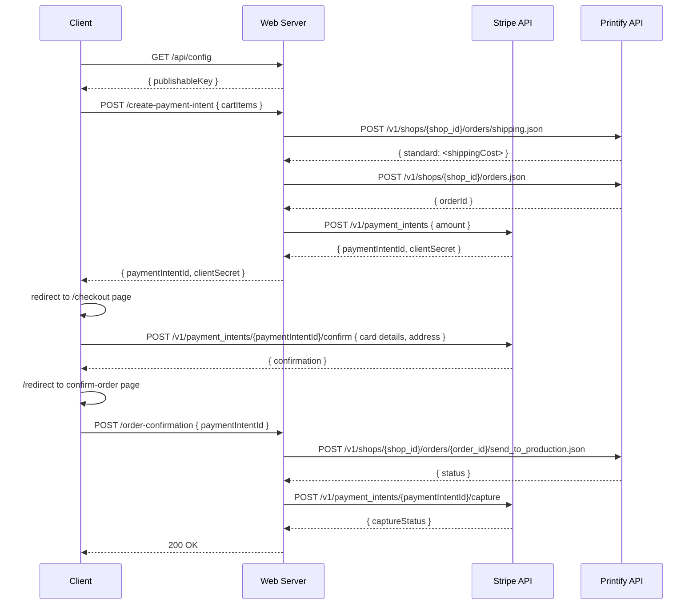

# SwagSticker Documentation

## System Diagram


## Product Catalog

- **Edit product listings:** [`src/lib/products.ts`](https://github.com/spencerlepine/swagsticker.com/blob/dev/src/lib/products.ts)
- **Edit image assets:**

```sh
git clone https://github.com/spencerlepine/swagsticker.com.git
cd swagsticker.com
git checkout assets
# *make changes*
git push origin assets
```

## Checkout Flow




## Load Testing

Run local load tests using [k6](https://k6.io) (browser-based)

```sh
cp .env.development .env.test
NODE_ENV=test npm run dev
```

```sh
brew install k6@0.57.0
go install go.k6.io/xk6/cmd/xk6@latest
k6 build --with github.com/grafana/xk6-browser
k6 run tests/e2e-test.js
```
