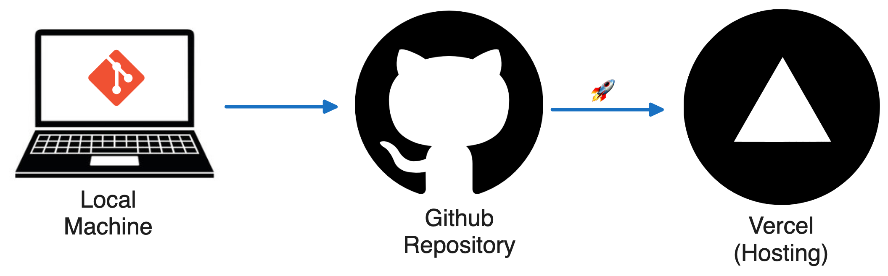
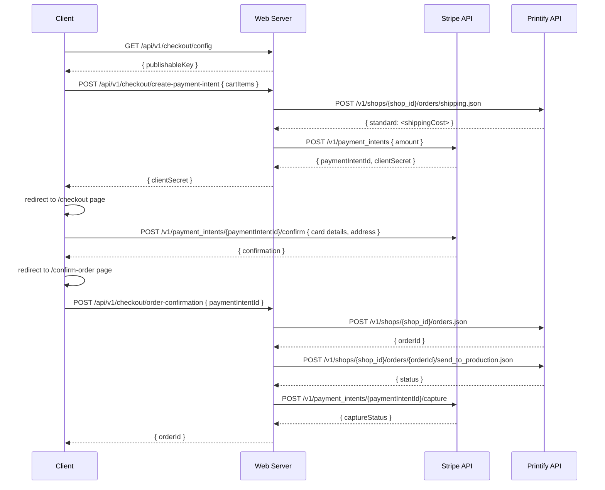

# SwagSticker Documentation

## System Diagram




## Product Catalog

- **Edit product listings:** [`src/lib/products.ts`](https://github.com/spencerlepine/swagsticker.com/blob/dev/src/lib/products.ts)
- **Edit image assets:**

```sh
git clone https://github.com/spencerlepine/swagsticker.com.git
cd swagsticker.com
git checkout assets
# *make changes*
git push origin assets
```

## Checkout Flow




## Data Schemas

### SwagCartItem (Client)

_See `src/types/index.ts` for details._

```typescript
export type SwagCartItem = {
  id: string; // Cart item ID
  name: string; // Product name
  description: string; // Product description
  quantity: number; // Item quantity
  price: number; // Product price
  image: string; // Image URL
  currency: string; // Currency (e.g., "USD")
  price_data?: object; // Stripe price_metadata (optional)
  product_data: {
    // Stripe product_metadata
    size: string; // Product size
    productId: string; // Product ID
    category?: string; // Product category (optional)
    type: string; // Product type
  };
};
```

### SwagOrderDetails

_See `src/types/index.ts` for details._

```typescript
export interface SwagOrderDetails {
  id: string; // Order ID
  date?: string; // Order date (optional)
  total?: number; // Total cost (optional)
  status?: string; // Order status (optional)
  address?: {
    // Shipping address (optional)
    city: string | null;
    country: string | null;
    line1: string | null;
    line2?: string | null;
    postal_code: string | null;
    state: string | null;
  };
  last4?: string | null; // Card last 4 digits (optional)
  receiptUrl?: string | null; // Receipt URL (optional)
  printifyOrderId?: string; // Printify order ID (optional)
  swagOrderId?: string; // Swag order ID (optional)
  shipments?: OrderShipment[]; // Shipments (optional)
  metadata?: {
    // Metadata (optional)
    order_type: string;
    shop_order_id: number;
    shop_order_label: string;
    shop_fulfilled_at: string;
  };
  line_items?: LineItem[]; // Line items (optional)
  total_price?: number; // Total price (optional)
  total_shipping?: number; // Shipping cost (optional)
  address_to?: { email: string }; // Recipient email (optional)
}
```

### StripePaymentIntent (Backend)

```typescript
import type { Stripe as StripeType } from 'stripe'; // v16.9.0
StripeType.PaymentIntent; // See Stripe API docs
```

### StripeCharge (Backend)

```typescript
import type { Stripe as StripeType } from 'stripe'; // v16.9.0
StripeType.Charge; // See Stripe API docs
```

### PrintifyOrder (Backend)

```typescript
import { type Order as PrintifyOrder } from 'printify-sdk-js'; // v1.3.0
PrintifyOrder; // See Printify SDK docs
```

## Load Testing

Run local load tests using [k6](https://k6.io) (browser-based)

```sh
cp .env.development .env.test
NODE_ENV=test npm run dev
```

```sh
brew install k6@0.57.0
go install go.k6.io/xk6/cmd/xk6@latest
k6 build --with github.com/grafana/xk6-browser

# run locally:
open -a "Google Chrome" http://localhost:5665 && \
TIMESTAMP=$(date +%Y%m%d-%H%M%S) && \
K6_WEB_DASHBOARD=true \
K6_WEB_DASHBOARD_EXPORT=tests/$TIMESTAMP-load-test-report.html \
k6 run tests/e2e-test.js

# debugging mode:
TIMESTAMP=$(date +%Y%m%d-%H%M%S) \
K6_BROWSER_HEADLESS=false \
K6_WEB_DASHBOARD=true \
K6_WEB_DASHBOARD_EXPORT=tests/$TIMESTAMP-load-test-report.html \
LOAD_TEST_DEBUG_MODE=true \
k6 run tests/e2e-test.js
```
